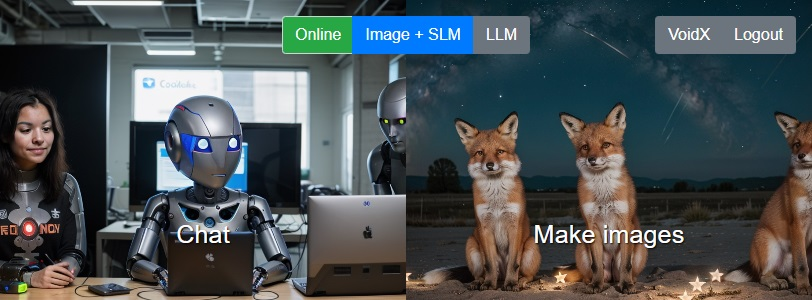
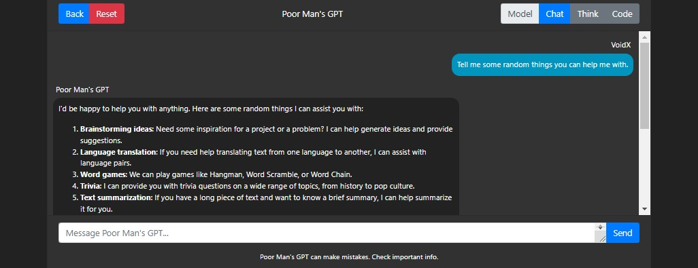
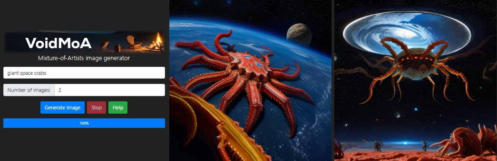

# Poor Man's AI
Your own chatbot and image generating AI service with the easiest possible
setup: a website available from everywhere you need, and a computer that handles
processing the prompts.

## Try it!
[This is how an example installation looks like](https://ai.sbence.hu), you'll
have something similar after a very easy installation process.

The home page hosts the AI selector, currently chat and image generation. Users
can register, and registration or full access can be opened on demand. Admins
can change the server from high quality chat-only mode to image generation and
a bit downsized chat on the side. 

The chat is split to multiple models, called by friendly names, and switching
between them is instant. You can even swap "personalities" mid-conversation.

Image generation is fast and easy. Models are swapped based on prompt (see Poor
Man's AI's MoA technology), resulting in better prompt following than standalone
models.

## Distinguishing tech
Poor Man's AI has a few tricks up its sleeve either first introduced in this
software or rarely found in the wild.

### Mixture-of-Artists (MoA)
The image generation part is based on allowing model swapping on demand. Prompts
can contain specific keywords or selectors that guide the image generator to
specific models, like the "photo" keyword could trigger the use of a model
trained on photos only to produce perfectly photorealistic results. When using
Stable Diffusion 1.5 models, this could mean that even terabytes of models can
result in a maximum VRAM usage of 6 GB with very fast generation speeds that
include model loading.

## How to install
Poor Man's AI is split into two parts: the Website and the Processor. They can
be downloaded, handled, and updated separately. The Website runs on any web
hosting service, including free ones. Users can prompt the AIs there. You can
handle who has access, you could close it for yourself or open it to anyone, or
just for friends. The Processor is the computer that handles your prompts and
replies with chat messages or generated images. It needs to be a mildly powerful
(mid-range gamer) PC that runs this software. Everything is nearly plug and
play, the default settings already provide a pretty powerful setup, you only
need to configure some accounts.

### System requirements
Poor Man's AI requires the following:
- SSD storage: 40 GB - HDDs don't provide sufficient performance
- GPU memory: 6 GB
- System memory: 8 GB

### Website
The downloadable Website is a zip file containing what you will eventually need
to upload to your chosen web hosting provider. But first, you have to prepare a
website. This tutorial is for the easiest method using a web hosting provider
and not for complete self hosting.
1. Download and unzip the Website.
1. Get a web hosting account with PHP and MySQL, free ones are fine.
1. Open `__config.php` with any text editor, like Notepad, and edit it according
   to your needs. What each setting does is written in the file. When you're
   done, don't forget to save the changes to this file.
1. Upload every folder and PHP file to the root of your web hosting server.
1. Go to <your website>/install.php, fill in the login data for your MySQL
   server that came with your web hosting account, provide an admin username and
   password, then click "Install". If it's successful, it will redirect you to
   the installed website, that is currently offline. Set up the Processor to
   make it online.

### Processor
The Processor requires the Website already set up, as it only works while
connected to one.
1. Download and unzip the Processor on the PC you want to run it on.
1. Go to the Configuration folder, and choose one file that matches your GPU, or
   is a bit lower in VRAM. Open that file with Notepad. What each setting does
   is written in the file. When you're done, don't forget to save the changes to
   this file.
1. Start the Processor application (PoorMansAI.exe). At first launch, it might
   take an hour to download and extract every dependency. This only happens at
   the first launch, subsequent startups are fast. When you don't see any
   download progress bars, and it says something like `Application startup
   complete` or `Model loaded in 3.0s` on the bottom few lines, you're ready to
   use your own AI service through your own website.

Note: extraction of Stable Diffusion WebUI can be *really* slow. To speed it up,
wait until the Processor has downloaded it, then close it and go to its cache
folder (set in the config files), and extract to the same folder with something
like 7-Zip. After it's done and you relaunch the Processor, it will continue the
first time startup from the same point.

### Fixing broken installations
* **Processor:** Every model and setting is stored in the unzipped folder that
  might have broken your installation. Just delete and redownload or unzip again
  to fix issues caused by misconfiguration or half-done downloads. Make sure to
  backup your settings.
* **Website:** Delete sql.php from the server and navigate to install.php again.

### Miscellaneous
* To add a new background to the chat or image generator components on your
  website, just go to its img folder, and create new diffbgXX.jpg or gptbgXX.jpg
  files with the images you want to use. XX is a number one larger than the
  previous largest in the folder.
* Developers can easily add addons to the Website's predefined extension points
  to easily publish them in a compatible format. More about addons in
  [their folder](./addons_web/README.md).

## Licence
By downloading the software and/or its source code, you are accepting these
terms. The source code, just like the compiled software, is given to you for
free, but without any warranty. It is not guaranteed to work, and the developer
is not responsible for any damages from the use of the software. You are allowed
to make any modifications, and release them for free under this licence. If you
release a modified version, you have to link this repository as its source. You
are not allowed to sell any part of the original or the modified version. You
are also not allowed to show advertisements in the modified software. If you
include these code or any part of the original version in any other project,
these terms still apply.
